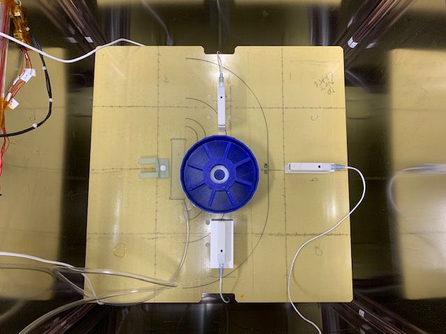

# Magnetic Cleanliness Screening

Authors: Cole Doorman, Chris Piker

## Summary

*fixme: Insert sentence on why the stray field and dipole moment must be know for parts on spacecraft*

Magnetic cleanliness screening is the process of determining the magnetic properties
of various parts before they are added to instrument and satellite  assemblies.  The
properties of interest are the stray field and dipole moment.  To determine these
properties the part in question is rotated in the presence of three, three-axis,
magnetometers.  Raw field measurements collected are then input into calculations
detailed below which provide the dipole moment and stray field at 1 meter.

## Apparatus

The following equipment is needed:

1. A cylinder of dry nitrogen.  This will be used to rotate the part
   without electric motors.

2. A turntable with paddles that intercept the escaping air.

3. Three Twinleaf VMR sensors.

4. The three labeled Twinleaf USB to differential serial UARTs 

5. A PC with this software installed.  For installation instructions
   see the file (doc/install.md)[doc/install.md]

Sensors are arrange around the turntable as depicted below.



## Screening Procedure

1. Open a shell window and type `python3 mag_screen OBJECT_ID` and do *not* press enter. 
   Here `OBJECT_ID` is a name or other identifier by which the object's data will be tracked.

2. Make sure the rotating plate is at rest. Then place the object to be screened onto the plate.

3. Turn the nitrogen gas relase value until the plate spins at about one revolution per **XXX** seconds.

4. Once the rotator plate is moving, hit enter in the shell to run the program.  This will
   output data to a CSV file and a PDF.  One containing test results the other containing
   best fit plots.

5. Turn off the compressed air flow.

6. Remove the object from the plate

## Output Archiving

*State where the output data are saved/tracked in the larger context of the TRACERS development program*

## Calculations

The data will be collected by three Twinleaf VMR magnetometers at three different distances away using the mag_screen program. The object being screened has an arbitrary dipole moment.  As the object is rotated it's internal field will periodically be positioned at a maxima and minima from each sensor.  Over the course of a few rotations the magnetometers will measure the sinusoidal x, y, z functions of the magnetic field B from the object. Using Welch's method, we will collapse the sinusoidal field components into a power spectral density, which when taken the square root of, will give us x, y, z scalar values of the magnetic field B.

The Bx, By, Bz data from each sensor (now 9 total points) is then put into a Python 3 function to project a dipole moment and stray field.  Using the law of cosines, we can find the angle of the magnetic field and subsequently dipole moment relative to the z-axis. Knowing this angle, we can project these values into their most aggressive orientation (directly parallel with the z-axis), giving us 6 total data points. Each magnetometer projects an aggressive dipole moment and an aggressive magnetic field for its respective distance. These data points are then plot and best-fit to a function 1/distance^3. The best fit taken is the new dipole moment with error being calculated using the SciPy library curve_fit function. Using the calculated best-fit aggressive dipole, we calculate the stray field away at one meters. The function finds 3 things:(1) The best fit dipole moment from the object's data, (2) The stray field in nanoTesla 1 meter away, and (3) an indication the object has passed the test if its dipole moment is <.05, fail if the dipole moment is >.05, and a caution if the dipole moment is .0475 < m < .05.


## The mag_shield_testing program

The main data collection program is `mag_shield_testing.py`.  It only
uses simple I/O and is ment to run in a terminal window or under 
`cmd.exe` on windows.  At present the data collection portion of the 
program and the magnetic moments calculations are not connected.

A terminal session follows with only an X axis sensor connected

```
$ ./mag_shield_testing.py -y "" -z "" 10 20 30 -t 10
Connecting to /dev/ttyUSB0 for X axis data.
VMR - Twinleaf VMR R12 N201 [2021-03-16/c7c589]
Use CTRL+C to quit early
Collecting ~10 seconds of data .........10.
X Axis: 204 rows collected
X Sensor, Row    0:   0.176 ( 12893.084,  14438.618,  29103.146)
          Row    1:   0.230 (  9663.970,  16602.135,  30022.584)
          Row    2:   0.282 (  4607.244,  18416.695,  31129.545)
          Row  204:  10.318 ( 13309.939,  21411.115, -28275.346)
Data formatter not yet implemented
CSV output function not yet implemented
PDF plotter function not yet implemented
```

## Extra

Original text:


The data from this function should be organized and saved into a .csv file. There should be four columns. (1) Object name, (2) Dipole moment (A\*m^2), (3) Stray field 1 meter away (nT), (4) Pass/Fail/Caution? The best fit graphs for each object need to be organized and saved into a .pdf file.
